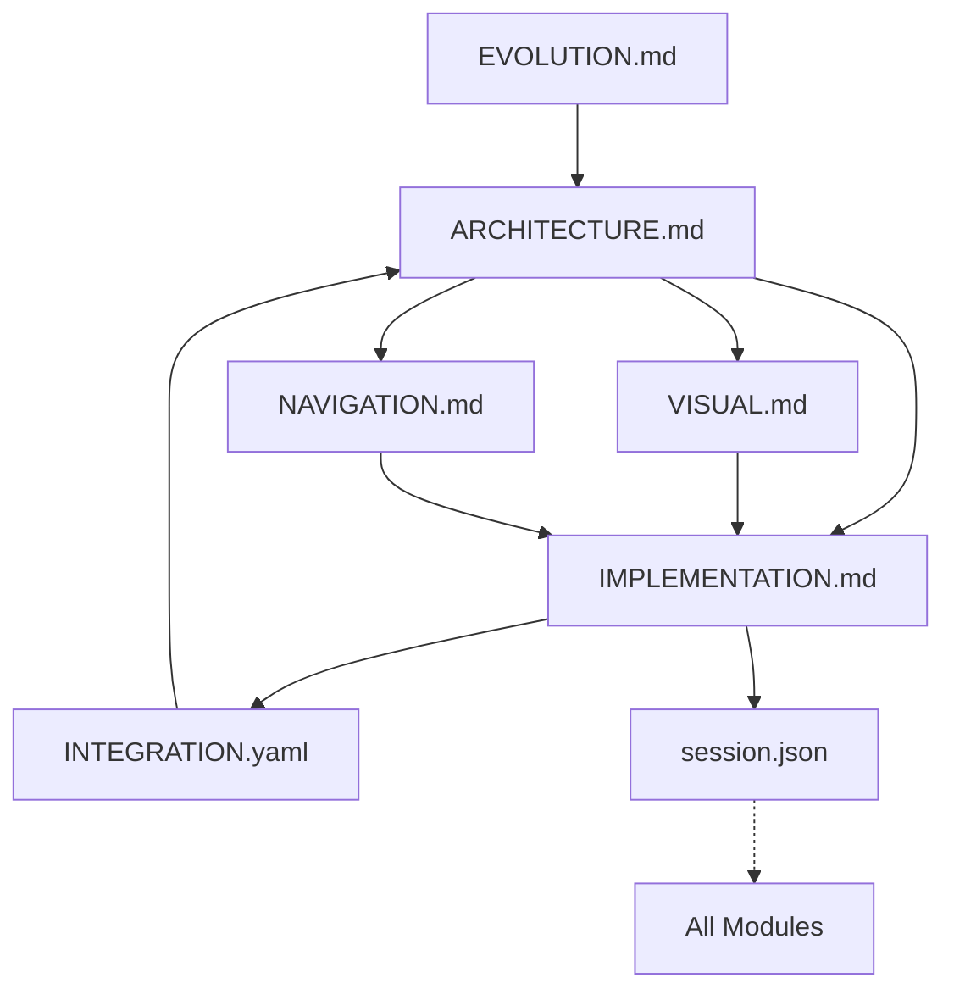

# GameCore Context Engineering Manifest

**Purpose**: Master reference for AI systems to understand the context module structure and efficiently locate information  
**Last Updated**: 2025-01-27  
**Manifest Version**: 2.0

## Module Version Registry

| Module | Version | Last Modified | Size | Health |
|--------|---------|--------------|------|---------|
| ARCHITECTURE.md | 1.3 | 2025-01-26 | 4.2KB | ✅ |
| IMPLEMENTATION.md | 1.5 | 2025-01-26 | 5.8KB | ✅ |
| VISUAL.md | 1.2 | 2025-01-26 | 3.9KB | ✅ |
| NAVIGATION.md | 1.1 | 2025-01-26 | 4.1KB | ✅ |
| INTEGRATION.yaml | 1.0 | 2025-01-26 | 2.3KB | ✅ |
| EVOLUTION.md | 1.4 | 2025-01-26 | 3.5KB | ✅ |
| session.json | - | DYNAMIC | 1.2KB | ✅ |

## Module Size Limits
```yaml
max_size_kb:
  ARCHITECTURE.md: 10
  IMPLEMENTATION.md: 15
  VISUAL.md: 10
  NAVIGATION.md: 10
  INTEGRATION.yaml: 5
  EVOLUTION.md: 20
  session.json: 3
```

## Module Dependency Graph


## Explicit Module Dependencies

### ARCHITECTURE.md
- **Depends on**: EVOLUTION.md (for historical context)
- **Depended by**: ALL (defines system structure)
- **Updates trigger**: IMPLEMENTATION.md, VISUAL.md, NAVIGATION.md

### IMPLEMENTATION.md
- **Depends on**: ARCHITECTURE.md (for design patterns)
- **Depended by**: session.json (tracks changes)
- **Updates trigger**: session.json, INTEGRATION.yaml

### VISUAL.md
- **Depends on**: ARCHITECTURE.md (component structure)
- **Depended by**: IMPLEMENTATION.md (UI components)
- **Updates trigger**: IMPLEMENTATION.md (component updates)

### NAVIGATION.md
- **Depends on**: ARCHITECTURE.md (state patterns)
- **Depended by**: IMPLEMENTATION.md (screen flow)
- **Updates trigger**: IMPLEMENTATION.md (navigation code)

### INTEGRATION.yaml
- **Depends on**: IMPLEMENTATION.md (integration points)
- **Depended by**: None (leaf node)
- **Updates trigger**: ARCHITECTURE.md (if major)

### EVOLUTION.md
- **Depends on**: None (historical record)
- **Depended by**: ARCHITECTURE.md (decisions)
- **Updates trigger**: ARCHITECTURE.md (patterns)

### session.json
- **Depends on**: ALL (tracks everything)
- **Depended by**: None (temporary)
- **Updates trigger**: None (ephemeral)

## Context Health Check

### Automated Validations
```python
health_checks = {
    "size_compliance": check_module_sizes(),
    "dependency_cycles": detect_circular_deps(),
    "cross_references": validate_references(),
    "version_sync": check_version_consistency(),
    "completeness": verify_required_sections(),
    "timestamp_freshness": check_update_recency()
}
```

### Health Indicators
- ✅ **Healthy**: All checks pass
- ⚠️ **Warning**: Size approaching limit OR outdated >7 days
- ❌ **Critical**: Size exceeded OR broken references OR circular deps

### Quick Health Status
```yaml
current_health:
  overall_score: 0.95
  issues: []
  warnings: 
    - "IMPLEMENTATION.md approaching size limit (87%)"
  last_full_check: "2025-01-27T10:00:00Z"
```

## Information Location Matrix

| Information Type | Primary | Secondary | Validation |
|-----------------|---------|-----------|------------|
| System design | ARCHITECTURE | EVOLUTION | Check patterns |
| Current state | IMPLEMENTATION | session | Match codebase |
| UI specs | VISUAL | ARCHITECTURE | Platform consistency |
| User flows | NAVIGATION | IMPLEMENTATION | State validity |
| External deps | INTEGRATION | ARCHITECTURE | Version match |
| Decisions | EVOLUTION | ARCHITECTURE | PDLR format |
| Active work | session | IMPLEMENTATION | Timestamp recent |

## Context Loading Algorithm
```python
def load_optimal_context(query_type):
    """Load minimum modules for maximum relevance"""
    
    # Base patterns
    patterns = {
        "bug_fix": ["IMPLEMENTATION", "session", "ARCHITECTURE"],
        "new_feature": ["ARCHITECTURE", "NAVIGATION", "VISUAL"],
        "visual_update": ["VISUAL", "IMPLEMENTATION"],
        "integration": ["INTEGRATION", "ARCHITECTURE"],
        "refactor": ["EVOLUTION", "ARCHITECTURE", "IMPLEMENTATION"],
        "status_check": ["IMPLEMENTATION", "session"],
        "history": ["EVOLUTION"],
    }
    
    # Load in dependency order
    modules = patterns.get(query_type, ["MANIFEST"])
    return load_modules_with_deps(modules)
```

## Module Update Rules

### Update Cascade Matrix
| Changed Module | Must Update | Should Check | May Impact |
|---------------|-------------|--------------|------------|
| ARCHITECTURE | IMPLEMENTATION | VISUAL, NAV | ALL |
| IMPLEMENTATION | session | INTEGRATION | VISUAL |
| VISUAL | - | IMPLEMENTATION | - |
| NAVIGATION | - | IMPLEMENTATION | session |
| INTEGRATION | - | ARCHITECTURE | - |
| EVOLUTION | - | ARCHITECTURE | - |
| session | - | - | - |

### Version Increment Rules
- **Patch** (x.x.N): Typos, clarifications, small additions
- **Minor** (x.N.x): New sections, significant updates
- **Major** (N.x.x): Structure changes, breaking updates

## AI Processing Optimizations

### Token Efficiency Scoring
```yaml
efficiency_metrics:
  information_density: 0.89  # info per token
  query_resolution: 0.94     # first-module success
  update_frequency: 0.15     # changes per day
  redundancy_score: 0.08     # duplicate info
```

### Query Resolution Shortcuts
```python
# Direct answering patterns
INSTANT_PATTERNS = {
    r"how.*work": "ARCHITECTURE",
    r"current.*status": "IMPLEMENTATION",
    r"look|appear|visual": "VISUAL",
    r"navigate|flow|screen": "NAVIGATION",
    r"why.*built": "EVOLUTION",
    r"integrate|external": "INTEGRATION"
}
```

### Context Compression Rules
1. Remove comments in code blocks
2. Use standard abbreviations (impl, nav, arch)
3. Collapse whitespace in tables
4. Minimize markdown formatting
5. Use reference codes vs full descriptions

## Module Quality Requirements

### Required Sections per Module
```yaml
ARCHITECTURE:
  required: [purpose, patterns, decisions, principles]
  optional: [examples, future]
  
IMPLEMENTATION:
  required: [status, structure, working, limitations]
  optional: [metrics, debt]
  
VISUAL:
  required: [design_system, colors, typography, animations]
  optional: [accessibility, future]
  
NAVIGATION:
  required: [hierarchy, destinations, flows, states]
  optional: [deep_linking, shortcuts]
  
INTEGRATION:
  required: [dependencies, apis, status]
  optional: [timeline, testing]
  
EVOLUTION:
  required: [decisions, format_pdlr, lessons]
  optional: [future_decisions]
```

## Performance Tracking

### Module Load Performance
```yaml
average_load_times_ms:
  MANIFEST: 5
  ARCHITECTURE: 12
  IMPLEMENTATION: 18
  VISUAL: 10
  NAVIGATION: 11
  INTEGRATION: 8
  EVOLUTION: 14
  session: 3
  
optimization_targets:
  total_context_load: <100ms
  single_module_max: <25ms
  full_validation: <500ms
```

## Maintenance Schedule

### Validation Frequency
- **Continuous**: Reference validation (on update)
- **Daily**: Size and health checks
- **Weekly**: Full consistency validation
- **Monthly**: Performance optimization review

### Module Review Cycle
- **ARCHITECTURE**: Monthly or on major changes
- **IMPLEMENTATION**: On every code change
- **VISUAL**: On design updates
- **NAVIGATION**: On flow changes
- **INTEGRATION**: On dependency updates
- **EVOLUTION**: After each decision
- **session**: Reset per conversation

## Error Recovery

### Common Issues & Fixes
```yaml
circular_dependency:
  detection: graph_cycle_check()
  resolution: identify_and_break_weakest_link()
  
size_exceeded:
  detection: file_size > limit
  resolution: extract_to_sub_module()
  
broken_reference:
  detection: validate_cross_refs()
  resolution: update_or_remove_ref()
  
version_mismatch:
  detection: compare_versions()
  resolution: cascade_version_update()
```

## Context Engineering Commands

### Quick Commands for AI
- `!status` - Load IMPLEMENTATION + session
- `!design` - Load ARCHITECTURE + VISUAL  
- `!history` - Load EVOLUTION
- `!full` - Load all modules
- `!validate` - Run health checks
- `!compress` - Optimize for tokens

### Module Path Resolution
```python
MODULE_PATHS = {
    "manifest": ".context/CONTEXT_MANIFEST.md",
    "arch": ".context/core/ARCHITECTURE.md",
    "impl": ".context/core/IMPLEMENTATION.md",
    "visual": ".context/core/VISUAL.md",
    "nav": ".context/core/NAVIGATION.md",
    "integration": ".context/dynamic/INTEGRATION.yaml",
    "evolution": ".context/dynamic/EVOLUTION.md",
    "session": ".context/dynamic/session.json"
}
```